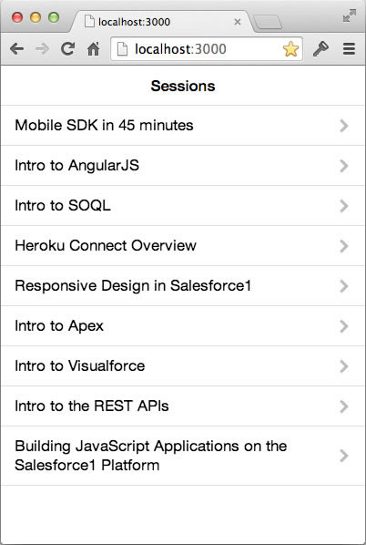
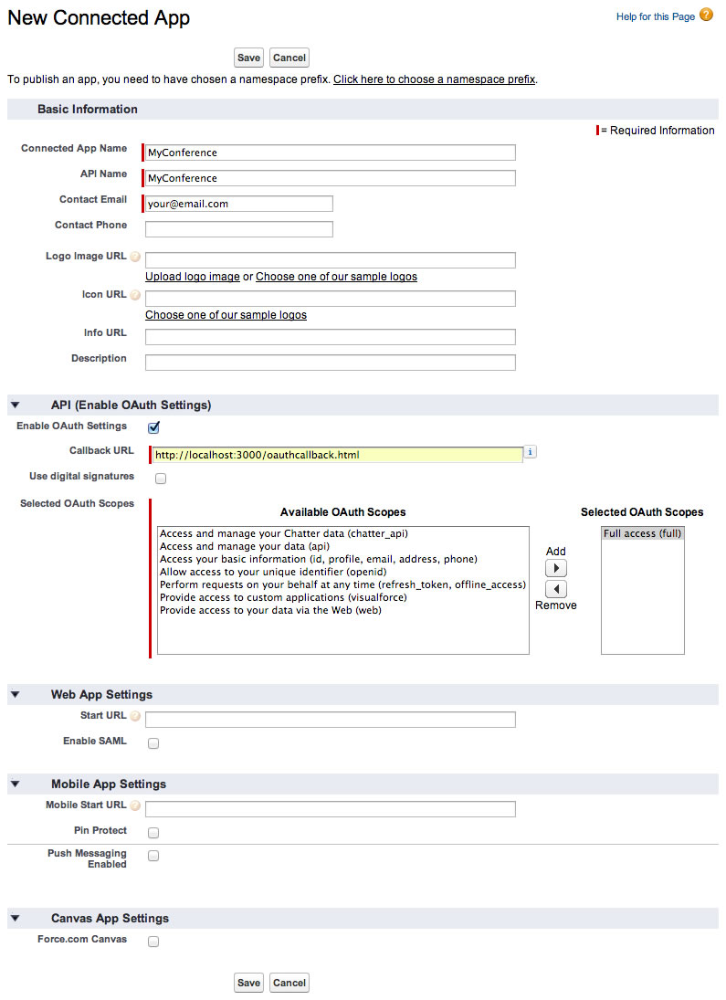
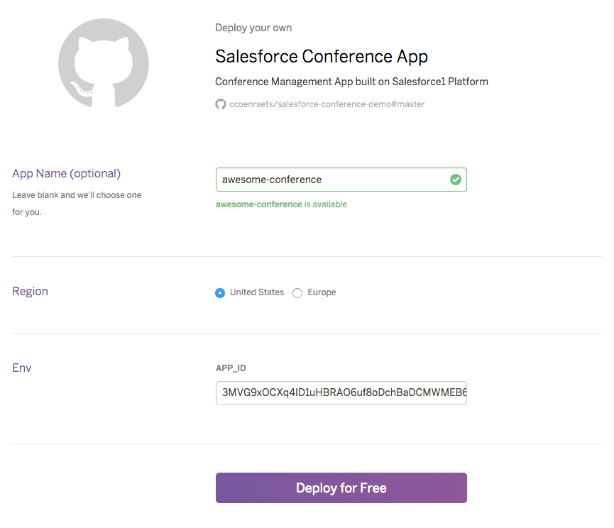
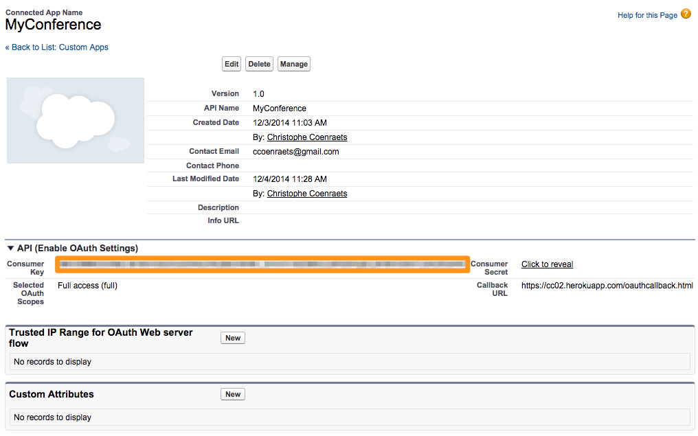

In this module, you deploy and configure a Node.js application on Heroku: The application uses OAuth to authenticate with Salesforce, and the REST APIs to access Salesforce data.

## Step 1: Create a Connected App

1. In Setup, click **Build** > **Create** > **Apps**

1. In the **Connected Apps** section, click **New**, and define the Connected App as follows:
  - Connected App Name: **MyConference**
  - API Name: **MyConference**
  - Contact Email: **enter your email address**
  - Enabled OAuth Settings: **Checked**
  - Callback URL: **http://localhost:3000/oauthcallback.html** (You'll change this later)
  - Selected OAuth Scopes: **Full Access (full)**

    

1. Click **Save** and **Continue**.

## Step 2: Create a Heroku Account

If you don't already have a Heroku account, follow the steps belowto create a free account:

1. Open a browser and access the following URL: [https://signup.heroku.com](https://signup.heroku.com)

2. Fill in the signup form and click **Create Free Account** button.

3. Check your email. You will receive an activation email for your free account.

4. Click the link in the activation email. Enter your new password information, and click **Set password and log in**.

## Step 3: Familiarize Yourself with the Application

1. Access [https://github.com/ccoenraets/salesforce-conference-demo](https://github.com/ccoenraets/salesforce-conference-demo)

1. Click the **client** link and then the **index.html** link to examine the code in **client/index.html**:
    - It doesn't have any HTML markup inside the body tag. The HTML is built dynamically in JavaScript in the app.js file.
    - It uses ratchet.css. [Ratchet](http://goratchet.com/) is a simple CSS toolkit that provides styles for mobile applications.
    - It uses [ForceJS](https://github.com/ccoenraets/forcejs) to integrate with Salesforce.
    - It makes an Ajax call to the server to get the Connected App Id

1. Examine the code in **client/js/app.js**:
    - It includes the basic logic to manage a single page application and generate HTML pages on the fly.
    - The **getSessionList()** function is responsible for retrieving the list of sessions from your Salesforce instance.
    - The **getSessionDetails()** function is responsible for retrieving the details of a specific session from your Salesforce instance.
    - The **showSessionList()** function is responsible for generating the HTML for the session list page
    - The **showSessionDetails()** function is responsible for generating the HTML for the session details page
    - The **router** object is responsible for detecting hashtag changes in the URL and loading the corresponding page 

1. Examine the code in **client/oauthcallback.html**:

    At the end of the OAuth workflow, the Salesforce authentication process loads the redirect URI you specified in your Connected App and passes the access token and other OAuth values (server instance, refresh token, etc.) in the query string. oauthcallback.html simply passes that information to the ForceJS library which uses it to make REST API calls to your Salesforce instance.

1. Examine the code in **server.js**. server.js implements a small HTTP server that provides two features:
    - Web server for static content. The document root for the web server is the client directory.
    - Proxy for Salesforce REST requests. Because of the browser’s cross-origin restrictions, your JavaScript application hosted on your own server (or localhost) will not be able to make API calls directly to the *.salesforce.com domain. The solution is to proxy your API calls through your own server.

## Step 4: Deploy the Application

1. In the repository [home page](https://github.com/ccoenraets/salesforce-conference-demo), click the **Deploy to Heroku** button
    
    - For **App Name**, specify a name for your application. For example, if you specify awesome-conference, your application will be available at https://awesome-conference.herokuapp.com. Your app name has to be unique on the herokuapp.com domain, so you may have to try a few names before finding one that's available.
    - For **APP_ID**, paste the consumer key of the connected app you created in step&nbsp;1.
        
    - Click the **Deploy For Free** button

1. In Salesforce, go back to your Connected App (Build > Create > Apps) and adjust the OAuth Callback URL based on your Heroku app name. For example: https://awesome-conference.herokuapp.com/oauthcallback.html
    

     > Make sure you are using **https** and replace **awesome-conference** with your own app name.

1. Click **Save** and **Continue**

## Step 5: Test the Application

1. Open a browser and access your application's URL on Heroku. For example: https://awesome-conference.herokuapp.com
    - Make sure you use **https**
    - Replace **awesome-conference** with your own app name
    - Your browser may block the OAuth authentication popup dialog. If that happens, make sure you enable the popup dialog.
    - If you get an error message (error=redirect_uri_mismatch&error_description=redirect_uri%20must%20match%20configuration) in the popup dialog, wait for a few minutes and try again: the changes you made to the OAuth callback URL in the previous step take a few minutes to become available.

1. Login with your Developer Edition credentials
1. You should now see the list of sessions
1. Click a session to see the details

> This is just the starting point for building a custom application written in JavaScript, authenticating with Salesforce using OAuth, and accessing Salesforce data using the REST APIs. If you are planning on building a real-life application based on this architecture, consider using a JavaScript framework such as [Backbone.js](http://backbonejs.org/) or [AngularJS](https://angularjs.org/) with [Ionic](http://ionicframework.com/).

## Extra Credit: Running Your Own Node.js Server

Follow [these](Using-the-Salesforce1-Platform-APIs.html) instructions.

<a href="Using-JavaScript-in-Visualforce-Pages.html" class="btn btn-default"><i class="glyphicon glyphicon-chevron-left"></i> Previous</a>
<a href="Using-Static-Resources.html" class="btn btn-default pull-right">Next <i class="glyphicon glyphicon-chevron-right"></i></a>

