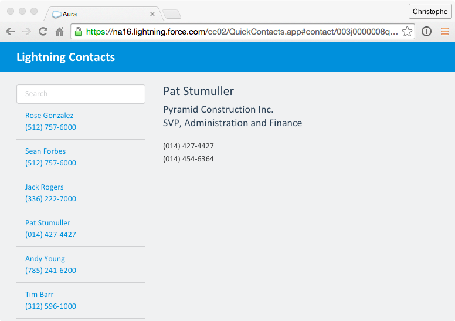

In this module, you create the ContactDetails component. When the user selects a contact in ContactList, ContactDetails automatically displays the details for the selected contact.

## What you will learn

- Manage the state of a Lightning application using the URL's hashtag
- Use Lightning's locationChange event


## Step 1: Create the ContactDetails Component

1. In the Developer Console, click **File** > **New** > **Lightning Component**. Specify **ContactDetails** as the bundle name and click **Submit**

1. Implement the component as follows:

    ```
    <aura:component controller="yournamespace.ContactController">

        <aura:attribute name="contact" type="Contact" default="{'sobjectType': 'Contact'}"/>
        <aura:handler event="aura:locationChange" action="{!c.locationChange}"/>

        <div class="details">
            <h1>{!v.contact.Name}</h1>
            <h3>{!v.contact.Account.Name}</h3>
            <h3>{!v.contact.Title}</h3>
            <p>{!v.contact.Phone}</p>
            {!v.contact.MobilePhone}
        </div>

    </aura:component>
    ```
    > Make sure you prefix the controller name with **your own namespace** you created in module 2.

    ### Code Highlights
    - The controller assigned to the component (first line of code) refers to the **server-side controller** (ContactController) you created in module 3.
    - The **contact** attribute is defined to hold the displayed Contact.
    - In the ContactList component you created in module 5, you wrapped each contact in the list with a ```<a href="{! '#contact/' + contact.Id }">``` anchor tag that sets the page hashtag to **#contact/** followed by the contact id of the clicked contact. In this component, the **locationChange** handler is defined to listen to hashtag changes, and execute the controller's locationChange() when it happens. The locationChange() function implemented in the next step retrieves and displays the selected contact.


1. Click **File** > **Save** to save the file


## Step 2: Implement the Controller

1. Click **CONTROLLER** (upper right corner in the code editor)

1. Implement the Controller as follows:

    ```
    ({
        locationChange : function(component, event, helper) {
            var token = event.getParam("token");
            if (token.indexOf('contact/') === 0) {
                var contactId = token.substr(token.indexOf('/') + 1);
                var action = component.get("c.findById");
                action.setParams({
                  "contactId": contactId
                });
                action.setCallback(this, function(a) {
                    component.set("v.contact", a.getReturnValue());
                });
                $A.enqueueAction(action);
            }
        }
    })
    ```

    ### Code Highlights:
    - The function first gets the new value of the hashtag available in the event object.
    - It then parses the hashtag to extract the contact id and invokes the **findById()** method in the Apex controller you created in module 3.
    - When the asynchronous call returns, it assigns the contact returned by findById() to the component's **contact** attribute.

1. Click **File** > **Save** to save the file

## Step 3: Style the Application

1. Click **STYLE** (upper right corner in the code editor)

1. Add the following styles

    ```
    .THIS p {
        margin: 20px 0 2px 0;
    }

    .THIS h1 {
        margin: 0 0 10px 0;
    }

    .THIS h3 {
        margin: 4px 0;
    }
    ```

1. Click **File** > **Save** to save the file

## Step 4: Add ContactDetails to the Application

1. In the Developer Console, go back to the **QuickContacts** application and modify the container layout as follows to add the ContactDetails component to the right of the list:

    ```
    <div class="container">
        <div class="row">
            <div class="col-sm-4">
                <yournamespace:SearchBar/>
                <yournamespace:ContactList/>
            </div>
            <div class="col-sm-8">
                <yournamespace:ContactDetails/>
            </div>
        </div>
    </div>
    ```

    > Make sure you prefix SearchBar, ContactList, and ContactDetails with **your own namespace** you created in module 2.

1. Click **File** > **Save** to save the file

1. Click **Update Preview** to run the application in the browser

    


<div class="row" style="margin-top:40px;">
<div class="col-sm-12">
<a href="create-searchbar-component.html" class="btn btn-default"><i class="glyphicon glyphicon-chevron-left"></i> Previous</a>
<a href="next.html" class="btn btn-default pull-right">Next <i class="glyphicon glyphicon-chevron-right"></i></a>
</div>
</div>
