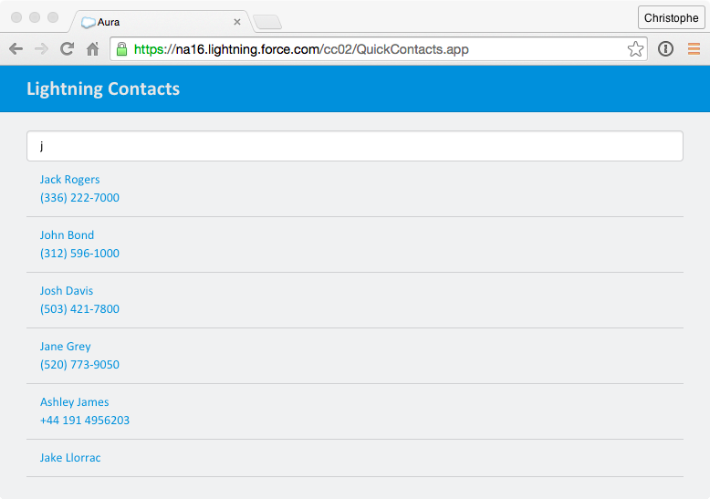

In this module, you create a SearchBar component that allows the user to search contacts by name. You could add the search bar to the ContactList component, but that would limit the reusability of the component: depending on specific UI requirements, you may want the search bar to be directly on top of the list (like you'll do here), integrated in the header, or somewhere else. You also want the ContactList component to be able to display a list of contacts independently of the type of search bar you use: regular input field with search button, type ahead search, etc. For these reasons, it's a good idea to decouple the search UI, from the display UI, and create two components: ContactList and SearchBar.

## What you will learn

- Create custom Lightning Events
- Communicate between components using events

## Step 1: Create the SearchKeyChange Event:

Now that we decided to build SearchBar and ContactList as two separate components, we need a way for ContactList to know when the search key changes so that it can retrieve and display the matching contacts. Lightning Events enable that kind of communication between components. In this step, you create a Lightning Event used by the SearchBar component to notify other components when the search key changes.

1. In the Developer Console, click **File** > **New** > **Lightning Event**. Specify **SearchKeyChange** as the bundle name and click **Submit**

1. Implement the event as follows:

    ```
    <aura:event type="APPLICATION">
        <aura:attribute name="searchKey" type="String"/>
    </aura:event>
    ```
    ### Code Highlights:
    - The event holds one argument: the new **searchKey**

1. Click **File** > **Save** to save the file

## Step 2: Create the SearchBar Component

1. In the Developer Console, click **File** > **New** > **Lightning Component**. Specify **SearchBar** as the bundle name and click **Submit**

2. Implement the component as follows:

    ```
    <aura:component>

        <input type="text" class="form-control" onkeyup="{!c.searchKeyChange}"
                placeholder="Search"/>

    </aura:component>
    ```
    ### Code Highlights:
    - This is a simple component with a single input field.
    - When the user types in a character (**onkeyup**), the **searchKeyChange()** function is executed in the component's client-side controller (you'll code that function in the next step). Using this approach the search is refined every time the user types in a character.


1. Click **File** > **Save** to save the file


## Step 3: Implement the Controller

1. Click **CONTROLLER** (upper right corner in the code editor)

1. Implement the Controller as follows:

    ```
    ({
        searchKeyChange: function(component, event, helper) {
            var myEvent = $A.get("e.yournamespace:SearchKeyChange");
            myEvent.setParams({"searchKey": event.target.value});
            myEvent.fire();
        }
    })
    ```

    > Make sure you prefix SearchKeyChange with **your own namespace** you created in module 2.

    ### Code Highlights:
    - The function first gets an instance of the **SearchKeyChange** event
    - It then sets the event's searchKey parameter to the input field's new value
    - Finally, it fires the event so that registered listeners can catch it

1. Click **File** > **Save** to save the file


## Step 4: Listen for the SearchKeyChange Event in ContactList

1. In the Developer Console, go back to the **ContactList** component

1. Add an event handler for the **SearchKeyChange** event (right after the init handler):

    ```
    <aura:handler event="yournamespace:SearchKeyChange" action="{!c.searchKeyChange}"/>
    ```

    > Make sure you prefix SearchKeyChange with **your own namespace** you created in module 2.


    ### Code Highlight:
    - The handler is set up to execute the **searchKeyChange()** function in the controller


1. Click **CONTROLLER** (upper right corner in the code editor)

1. Add the **searchKeyChange()** function implemented as follows:

    ```
    searchKeyChange: function(component, event) {
        var searchKey = event.getParam("searchKey");
        var action = component.get("c.findByName");
        action.setParams({
          "searchKey": searchKey
        });
        action.setCallback(this, function(a) {
        	component.set("v.contacts", a.getReturnValue());
        });
        $A.enqueueAction(action);
    }
    ```

    > Make sure you separate the doInit() and the searchKeyChange() functions with a comma

    ### Code Highlights:
    - The function first gets the value of the new searchKey available in the event object.
    - It then invokes the **findByName()** method in the Apex controller you created in module 3.
    - When the asynchronous call returns, it assigns the list of contacts returned by findByName() to the component's **contacts** attribute.


1. Click **File** > **Save** to save the file

## Step 5: Add SearchBar to the Application

1. In the developer console, go back to the **QuickContacts** application and add the SearchBar component to the user interface.

    ```
    <div class="container">
        <div class="row">
            <div class="col-sm-12">
                <yournamespace:SearchBar/>
                <yournamespace:ContactList/>
            </div>
        </div>
    </div>
    ```

    > Make sure you prefix SearchBar and ContactList with **your own namespace** you created in module 2.

1. Click **File** > **Save** to save the file

1. Click **Update Preview** to preview the application in the browser

    

<div class="row" style="margin-top:40px;">
<div class="col-sm-12">
<a href="create-contactlist-component.html" class="btn btn-default"><i class="glyphicon glyphicon-chevron-left"></i> Previous</a>
<a href="create-contactdetails-component.html" class="btn btn-default pull-right">Next <i class="glyphicon glyphicon-chevron-right"></i></a>
</div>
</div>
